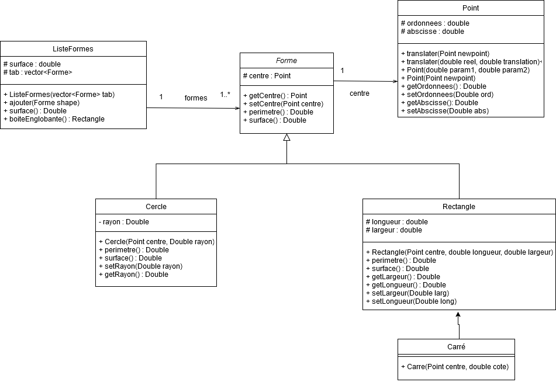

# Rapport TP7 Classes
BERNIER Laurène - COUSSEAU Yanis

## 1. Classe Point

### Implémentation

On définit la classe Point comme suit:

```c++
class Point{
private:
    double ordonnees;
    double abscisse;
public :
    void translater(Point const &newpoint);
    void translater(double reel, double translation);

    Point();
    Point(double param1, double param2);
    Point(const Point &newpoint);

    double getOrdonnee() const;
    void setOrdonnee(double ord);

    double getAbscisse() const;
    void setAbscisse(double abs);
};
```

L'implémentation des constructeurs est basique:
```c++
Point::Point(){
    ordonnees = 0;
    abscisse = 0;
}

Point::Point(double ord, double absc){
    ordonnees = ord;
    abscisse = absc;
}

Point::Point(const Point &newpoint){
    ordonnees = newpoint.getOrdonnee();
    abscisse = newpoint.getAbscisse();
}
```

Les accesseurs et les mutateurs sont tous extremement basiques et ont tous la même forme (exemple ci-dessous pour le champ abscisse):

```c++
double Point::getAbscisse() const{
    return abscisse;
}

void Point::setAbscisse(double abs){
    abscisse = abs;
}
```
Tous les autres accesseurs/mutateurs suivront ce modèle et ne seront donc pas explicités dans ce rapport.

La fonction "translater" ne fait qu'effectuer une addition de l'abscisse/ordonnée du point et du paramètre:

```c++
void Point::translater(Point const &newpoint){
    ordonnees += newpoint.getOrdonnee();
    abscisse += newpoint.getAbscisse();
}

void Point::translater(double ordo, double absc){
    ordonnees += ordo;
    abscisse += absc;
}
```

### Jeux d'essais

Avec le programme principal suivant:
```c++
Point point1 =Point();
    Point point2 =Point(5,2);
    Point point3 =Point(point2);

    double ord = point1.getOrdonnee();
    double absc = point1.getAbscisse();

    cout<<"Point3 : Ordonnée "<<point3.getOrdonnee()<<" Abscisse "<<point3.getAbscisse()<< " (attendus 5 2)" <<endl;
    cout<<"Point2 : Ordonnée "<<point2.getOrdonnee()<<" Abscisse "<<point2.getAbscisse()<< " (attendus 5 2)"<<endl;
    cout<<"Point1 : Ordonnée "<<ord<<" Abscisse "<<absc << " (attendus 0 0)"<<endl;

    point1.translater(point2);
    point2.translater(10, 10);

    cout<<"Point1 : Ordonnée "<<point1.getOrdonnee()<<" Abscisse "<<point1.getAbscisse() << " (attendus 5 2)" <<endl;
    cout<<"Point2 : Ordonnée "<<point2.getOrdonnee()<<" Abscisse "<<point2.getAbscisse() << " (attendus 15 12)"<<endl;

    point3.setOrdonnee(20);
    point3.setAbscisse(20);

    cout<<"Point3 : Ordonnée "<<point3.getOrdonnee()<<" Abscisse "<<point3.getAbscisse() << " (attendus 20 20)"<<endl;
```

Nous obtenons la sortie suivante:

```
Point3 : Ordonnée 5 Abscisse 2 (attendus 5 2)
Point2 : Ordonnée 5 Abscisse 2 (attendus 5 2)
Point1 : Ordonnée 0 Abscisse 0 (attendus 0 0)
Point1 : Ordonnée 5 Abscisse 2 (attendus 5 2)
Point2 : Ordonnée 15 Abscisse 12 (attendus 15 12)
Point3 : Ordonnée 20 Abscisse 20 (attendus 20 20)
```

Les fonctions fonctionnent donc correctement.

## 2. Surcharge d'opérateurs

### Implémentation

L'objectif est de faire en sorte que l'opérateur ``+=`` effectue une translation.

Pour surcharger l'opérateur ``+=`` il faut simplement rajouter la méthode suivante à la déclaration de la classe ``Point``:

```c++
Point& operator+=(const Point& valeur);
```

Puis de l'implémenter comme suit :
```c++
Point& Point::operator+=(const Point& valeur){
    translater(valeur);
    return *this;
}
```

On veut aussi surcharger l'opérateur ``<<`` afin de simplifier l'affichage d'un ``Point``.

Pour ce faire, il faut implémenter la fonction suivante:
```c++
std::ostream& operator<<(std::ostream& os, Point const& p) {
    os << "Abscisse : " << p.getAbscisse() << " Ordonnée: " << p.getOrdonnee();
    return os;
}
```

### Jeux d'essais

On peut vérifier le bon fonctionnement en rajoutant le code ci-dessous à la suite du programme précédent:

```c++
cout << point3<<endl;
point1+= point2;
cout << point1<< " (attendus 14 20)" << endl;
```

On obtient la sortie suivante:
```
Abscisse : 20 Ordonnée: 20
Abscisse : 14 Ordonnée: 20 (attendus 14 20)
```

On constate le bon fonctionnement des opérateurs surchargés.

## 3. Formes géométriques abstraites

On veut définir une classe ``Forme`` comme suit:

```c++
class Forme{
protected :
    Point centre;

    
public :

    Point getCentre() const;
    void setCentre(Point centre);

    Forme& operator+=(const Point& valeur);

    double perimetre();
    double surface();

};

std::ostream& operator<<(std::ostream& os, Forme const& forme);
```

C'est une classe abstraite car on ne fournit pas d'implémentation des fonctions périmetre et surface. On donne cependant les implémentations des accesseurs/mutateurs de centre ainsi que les surcharges des opérateurs ``+=`` et ``<<``:

```c++
Forme& Forme::operator+=(const Point& valeur){
    centre.translater(valeur);
    return *this;
}

std::ostream& operator<<(std::ostream& os, Forme const& forme) {
    os << "Centre : " << forme.getCentre();
    return os;
}
```

Le centre étant le seul attribut commun aux formes, on ne peut afficher que celui-ci.

## 4. Formes géométriques concrètes

On obtient le diagramme de classes suivant:



### Implémentation

Pour chaque classe on ne montre que l'implémentation des fonctions clés (surface, perimetre).

#### 1. Cercle

La classe cercle ne contient que son attribut rayon.

Son constructeur est donc le suivant:

```c++
Cercle::Cercle(Point centre, double rayon){
    this->rayon = rayon;
    this->setCentre(centre);
}
```

Les fonctions perimetres et surface sont implémentées de la façon suivante:
```c++
double Cercle::perimetre(){
    return 2*3.14159265*rayon;
}

double Cercle::surface(){
    return 3.14159265*rayon*rayon;
}
```

#### 2. Rectangle

La classe rectangle contient sa largeur et sa longueur.

Son constructeur est donc le suivant:
```c++
Rectangle::Rectangle(Point centre, double longueur, double largeur){
    this->longueur = longueur;
    this->largeur = largeur;
    this->setCentre(centre);
}
```

Ses fonction perimetre et surface sont définies comme suit:
```c++
double Rectangle::perimetre(){
    return (2*longueur)+(2*largeur);
}

double Rectangle::surface(){
    return longueur*largeur;
}
```

#### 3. Carré

Le carré est un rectangle avec largeur=longueur.

Il suffit donc de définir un constructeur qui n'accepte qu'une seule longueur de côté:
```c++
Carre::Carre(Point centre, double cote): Rectangle(centre,cote, cote){
    
}
```

### Jeux d'essais

On peut tester la bonne implémentation des classes avec le programme suivant:

```c++
//Test essai objet Cercle :
    Cercle cercle = Cercle(point3, 22);
    cout<<cercle;
    cout<<"Périmètre (attendu ~138): " << cercle.perimetre() << endl; 
    cout<<"Surface (attendu ~1520): " << cercle.surface() << endl;
    //Test essai objet Rectangle :
    Rectangle rect1 = Rectangle(point2, 5, 3);//creation d'un type rectangle
    cout<<rect1;
    cout<<"Périmètre (attendu 16): " << rect1.perimetre() << endl; 
    cout<<"Surface (attendu 15): " << rect1.surface() << endl;

    //Test essai objet Carre :
    Carre carre = Carre(point1, 10);
    cout << carre;
    cout<<"Périmètre (attendu 40): " << carre.perimetre() << endl; 
    cout<<"Surface (attendu 100): " << carre.surface() << endl;
```

On obtient la sortie suivante:

```
Cercle: 
Centre: Abscisse : 20 Ordonnée: 20
Rayon: 22
Périmètre (attendu ~138): 138.23
Surface (attendu ~1520): 1520.53
Rectangle: 
Centre: Abscisse : 12 Ordonnée: 15
Longueur: 5
Largeur: 3
Périmètre (attendu 16): 16
Surface (attendu 15): 15
Carre: 
Centre: Abscisse : 14 Ordonnée: 20
Côté: 10
Périmètre (attendu 40): 40
Surface (attendu 100): 100
```

On peut constater le bon fonctionnement des opérateurs surchargés, ainsi que des fonctions périmètre et surface pour chaque forme.

## 5. Liste de formes

On définit la classe ListeFormes de la manière suivante:

```c++
class ListeFormes{
protected :
    vector<Forme*> tab;
public :
    void ajouter(Forme* shape);
    double surface();
    Rectangle boiteEnglobante();
};
```

Pour implémenter la fonction surface, on itère sur les formes de la liste afin de calculer leur surface que l'on additionne.

```c++
double ListeFormes::surface(){
    double s=0;
    for(int i=0;i<this->tab.size();i++){
        s += this->tab[i]->surface();
    }
    return s;
}
```

Par manque de temps, nous n'avons pas implémenté la fonction boiteEnglobante.

### Jeux d'essais

On peut vérifier le bon fonctionnement de la fonction surface avec la fonction suivante:

```c++
 ListeFormes liste = ListeFormes();

liste.ajouter(&cercle);
liste.ajouter(&rect1);
liste.ajouter(&carre);

cout << "Surface liste (attendu ~1635): " << liste.surface() << endl;
```

On obtient la sortie suivante:
```
Surface liste (attendu ~1653): 1635.53
```

On peut donc en déduire que l'implémentation est correcte.